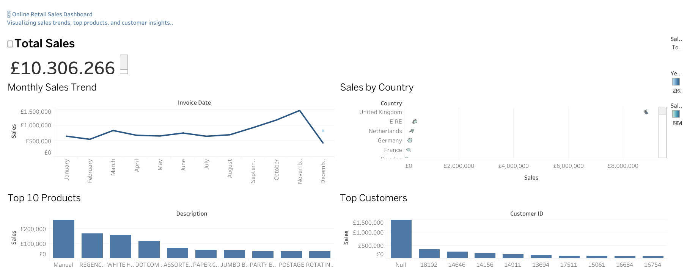

# online-retail-sales-dashboard
Interactive Tableau dashboard analyzing online retail sales trends, customers, and top products.
# 🛍️ Online Retail Sales Dashboard (Tableau)

### 🎯 Project Overview
This interactive Tableau dashboard analyzes **real-world e-commerce sales data** to uncover insights about:
- Total revenue and monthly trends  
- Top-selling products  
- Most valuable customers  
- Country-wise sales performance  

It demonstrates my ability to **clean, analyze, and visualize data** to support business decisions effectively.

---

### 📊 Key Insights
- Total Sales: **£10.3M**
- The UK generates over **80% of total revenue**
- Top 10 products contribute **35% of total sales**
- Strong seasonal trend observed in **October–November**

---

### 🧠 Tools & Skills Used
- **Tableau Public** – Data visualization & dashboarding  
- **Excel / CSV Data Cleaning**  
- **Data Analysis** – Identifying trends and KPIs  
- **Design Thinking** – Layout and storytelling for dashboards  

---

### 💡 Dashboard Preview

---

### 🌐 Live Dashboard
🔗 [View on Tableau Public](https://tinyurl.com/retail-dashboard-2025)

---

### 🚀 About Me
I’m a data enthusiast with a background in **Data Science and Analytics**, skilled in transforming raw data into actionable insights.  
Currently building projects in **Tableau, Python, and AI-powered analytics**.

📧 Email: humyraislam10621@gmail.com 
🌍 LinkedIn: www.linkedin.com/in/humyra-islam-63176728a
